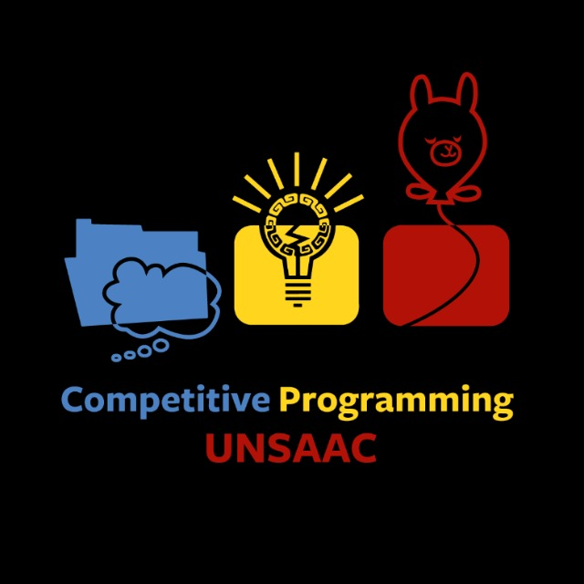

# Guia para subir problemas a codeforces.

En esta página es una guía que te permite subir problemas a codeforces, principalmente del cuscontest y para ayudar a las personas
del ACM chapter UNSAAC y programación competitiva UNSAAC

Para personas que no sabe cómo usar testlib, principalmente validator, en este [link](validator.md) te permitirá saber cómo hacer validators.

Una vez hecho, puedes usar este [link](polygon.md) para saber cómo subir un problema a codeforces.